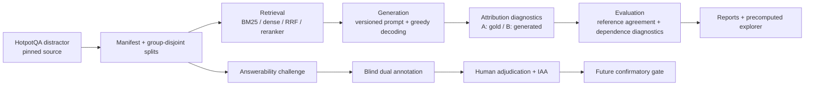

# RAG Evidence Attribution Bench

[](https://github.com/kuotunyu/rag-evidence-attribution-bench/actions/workflows/ci.yml)
[](https://github.com/kuotunyu/rag-evidence-attribution-bench/releases/tag/v0.1.0)
[](pyproject.toml)
[](LICENSE)

一個可重現、可稽核的 RAG benchmark，用來比較檢索、生成與「回答依賴哪些候選證據」的 attribution diagnostics。

[English](README_en.md) · [歷史 v0.1 完整證據](docs/HISTORICAL_V01_EVIDENCE_ZH.md) · [Dataset v2](docs/DATASET_V2.md) · [Challenge v1](docs/CHALLENGE_V1.md)

## Honest boundary

本 repository 同時包含兩個必須分開理解的層次：

- `v0.1.0` 是已發布、可重現的歷史 closed-candidate 描述性基線。
- Dataset v2 與 960 題 Answerability Challenge 是 `main` 上的後續工程候選。
- v2 confirmatory benchmark 尚未執行。
- 640 筆 missing-hop／evidence-swap 候選仍需兩位獨立標註者與第三位 adjudicator。
- 尚無正式 v2 model output、confirmatory effect estimate 或 v1.0 flagship claim。

這個 benchmark 評量固定 HotpotQA distractor 候選集合內的行為，不是 open-corpus
retrieval benchmark。它也不把 passage agreement 當成因果 ground truth：
reference agreement is not causal ground truth and is not complete faithfulness。

`leave_one_out` 是 deletion-based teacher-forced target-dependence diagnostic；
`arc_jsd` 是 experimental distributional-dependence diagnostic。Sufficiency 與
comprehensiveness 在 construct validation 通過前都只稱 diagnostic。

## Key results：歷史 v0.1

以下數字來自已提交的 v0.1 artifacts；它們可以保留為 closed-candidate 描述性結果，
但不能外推為 open-corpus 或 causal claim。

### Retrieval（eval，n=240）

| method | Recall@2 | Recall@5 | MRR | nDCG@10 |
|---|---:|---:|---:|---:|
| BM25 | 0.598 | 0.823 | 0.862 | 0.831 |
| Dense | 0.694 | 0.885 | 0.930 | 0.888 |
| Hybrid RRF | 0.667 | 0.887 | 0.927 | 0.886 |

### Generation（eval，n=240）

| model | EM | F1 | citation precision | citation recall | abstain rate |
|---|---:|---:|---:|---:|---:|
| Qwen3-4B Instruct, greedy | 0.362 | 0.496 | 0.940 | 0.745 | 0.200 |

### Attribution 的可保留解讀

- Mode A 固定官方 gold answer，量測 passage removal 對 target score 的依賴。
- Mode B 固定模型自己生成的 answer，再做 attribution。
- Supporting-fact metrics 是 reference agreement，不是機制層級 ground truth。
- v0.1 的 eval 沒有 Dataset v2 的 title／paragraph group isolation。
- 完整 split、method、control、uncertainty 與 secondary tables 在
  [歷史證據文件](docs/HISTORICAL_V01_EVIDENCE_ZH.md)。

<!-- RESULTS:BEGIN -->
歷史 v0.1 的完整機器產生表格已移至
[`docs/HISTORICAL_V01_EVIDENCE_ZH.md`](docs/HISTORICAL_V01_EVIDENCE_ZH.md)。
這個 homepage 僅保留最能說明工程範圍的已驗證摘要。
<!-- RESULTS:END -->

## Architecture



核心設計原則：

1. 資料來源、revision、split、prompt 與 scientific config 都可雜湊綁定。
2. JSONL stages append-only，可 resume，且拒絕 scientific-config mismatch。
3. fake backend 與真實 run 以 `execution_kind` 隔離。
4. report 只呈現 real artifacts；mock output 不會進首頁結果。
5. v1／v2、natural／challenge、pilot／confirmatory namespace 不互相覆蓋。
6. GPU／模型依賴 lazy import；precomputed explorer 走 CPU-only container。

## Methods

### Retrieval

| method | role | implementation note |
|---|---|---|
| `bm25` | sparse baseline | fixed Hotpot distractor candidates |
| `dense` | semantic retrieval | Qwen3-Embedding-0.6B |
| `hybrid_rrf` | rank fusion | deterministic reciprocal-rank fusion |
| `hybrid_rrf_rerank` | controlled extension | pinned bge-reranker-v2-m3 |

### Generation

- Generator：`Qwen/Qwen3-4B-Instruct-2507`。
- Decoding：greedy，`do_sample=False`，`num_beams=1`。
- v1 prompt：passage citations `[P#]`，保留歷史相容性。
- v2 contract：sentence citations `[P#.S#]`，只在新 run 使用。
- Abstention：`INSUFFICIENT EVIDENCE`。
- 每個 run 記錄 prompt hash、dtype、quantization、runtime 與硬體 metadata。

### Attribution diagnostics

| method | interpretation | modes |
|---|---|---|
| `citations` | model self-report reference | generated |
| `embedding` | question/answer-to-passage similarity | gold + generated |
| `leave_one_out` | deletion-based target dependence | gold + generated |
| `arc_jsd` | experimental distributional dependence | gold + generated |
| `contextcite` | optional surrogate regeneration | generated |
| `oracle_gold` | construct positive control | gold + generated |
| `control_random` | null control | gold + generated |
| `control_answer_string` | lexical construct control | gold + generated |
| `control_lexical` | question-answer lexical baseline | gold + generated |

### Metrics

- Retrieval：Recall@k、MRR、nDCG@10。
- Generation：EM、token F1、abstention、citation precision／recall／F1。
- Attribution：precision／recall／F1@k、MAP、nDCG@10。
- Dependence diagnostics：sufficiency、comprehensiveness。
- Uncertainty：paired or cluster bootstrap，依 protocol 決定 sampling unit。
- Annotation：raw agreement、Cohen's kappa、Krippendorff's alpha、evidence-set overlap。

## Dataset v2 and answerability challenge

Dataset v2 固定 HotpotQA revision
`1908d6afbbead072334abe2965f91bd2709910ab`，以 normalized title 與 paragraph
fingerprint 的 connected components 做 group-disjoint allocation。

| split | questions | groups | bridge | comparison | role |
|---|---:|---:|---:|---:|---|
| smoke | 20 | 15 | 16 | 4 | tooling smoke |
| dev | 60 | 42 | 48 | 12 | development |
| eval | 240 | 128 | 192 | 48 | frozen public candidate |

Challenge v1 對每個 parent 建立三個 deterministic transforms：

| transform | records | current gate |
|---|---:|---|
| answer-bearing distractor | 320 | engineering-eligible；primary use仍需 protocol |
| missing hop | 320 | pending two independent humans |
| evidence swap | 320 | pending two independent humans |

960 題不是 960 個獨立 experimental units；variants nested within parent，parents 又屬於
leakage groups。正式分析必須保留這個 hierarchy。

## Annotation-ready plan

- [Pilot protocol](PILOT_PROTOCOL.md)：20 parents，只測 instructions、UI、時間與分歧原因。
- [Confirmatory draft](PREREGISTRATION_V2_CONFIRMATORY_DRAFT.md)：預定 160 eval parents；仍是 DRAFT。
- Pilot rows 永遠不進 confirmatory primary analysis。
- Codex、LLM 或規則系統不能產生 human decisions，也不能自動 adjudicate。
- Formal eligibility 需要兩位獨立 annotators；不一致時需要第三位獨立 adjudicator。
- IAA < 0.70 會阻止 protocol promotion。
- Formal endpoints、exclusions 與 multiplicity family 必須在 model output 前凍結。

## Reproducibility

### CPU-only setup

```powershell
git clone https://github.com/kuotunyu/rag-evidence-attribution-bench.git
cd rag-evidence-attribution-bench
uv sync --frozen --extra app
uv run rag-evidence --help
uv run pytest -m "not gpu and not slow" -q
```

Windows 建議使用 ASCII-only checkout/worktree path；非 ASCII parent path 可能讓
editable `.pth` 在 CP950 startup locale 解碼失敗。

### Data preparation

```powershell
uv sync --frozen --extra ml --extra app
uv run rag-evidence data prepare --config configs/v2/smoke.yaml
uv run rag-evidence data challenge --config configs/v2/eval.yaml
```

這些命令只重建 pinned data artifacts；不代表完成 human review 或 confirmatory run。

### Historical pipeline surface

```powershell
uv run rag-evidence retrieve --method bm25 --config configs/smoke.yaml
uv run rag-evidence generate --config configs/smoke.yaml
uv run rag-evidence attribute --method leave_one_out --config configs/smoke.yaml
uv run rag-evidence evaluate --config configs/smoke.yaml
uv run rag-evidence report --config configs/smoke.yaml
uv run rag-evidence serve --config configs/full.yaml
```

`generate` 與 model-based attribution 是 GPU stages；本 repository 的一般 CI 不執行它們。

### Docker explorer

```powershell
docker compose up --build explorer
```

Explorer 只讀 precomputed artifacts；image 設定 Hugging Face offline flags，不下載模型。

## Tests and CI

CI 固定執行：

- `uv sync --frozen`
- Ruff formatting check
- Ruff lint
- strict mypy over `src`
- non-GPU／non-slow pytest with coverage
- CPU Docker build
- `/health` 與 `/methods` probes

本機完整檢查：

```powershell
uv run ruff format --check .
uv run ruff check .
uv run mypy src
uv run pytest -m "not gpu and not slow" -q
uv build
```

## Limitations

1. v0.1 是 fixed-candidate benchmark，不估 open-corpus retrieval quality。
2. v0.1 split 沒有 v2 的 group isolation，eval 僅為描述性。
3. HotpotQA supporting facts 可能不完整或有冗餘。
4. Passage removal 可能造成 distribution shift，不能單獨識別 causal effect。
5. Reference agreement 不等於完整 faithfulness。
6. Mode B 的 agreement subset 受 generator correctness selection 影響。
7. ARC-JSD 尚未對 official reference implementation 完成 validation。
8. ContextCite adapter attributes its own regeneration，與 stored answer 有 target mismatch。
9. Dataset v2 是公開 frozen candidate，不是永久 blind test set。
10. Challenge negative transforms 的 answerability 尚未經 independent humans 完成。
11. 目前沒有正式 v2 effect estimate、IAA 或 adjudicated eligibility artifact。
12. Software MIT license 不會覆蓋內嵌 HotpotQA text 的 CC BY-SA 4.0 義務。

## Repository map

```text
src/rag_evidence/       benchmark package
configs/                v0.1, v2 and reranking configs
data/manifests/         immutable split/challenge manifests
results/                committed raw/derived evidence
tests/                  offline synthetic and contract tests
docs/                   methods, dataset and historical evidence
notebooks/              explicit GPU workflows
app/                    precomputed explorer entrypoint
```

## Detailed evidence

- [歷史 v0.1 完整結果與方法](docs/HISTORICAL_V01_EVIDENCE_ZH.md)
- [Historical v0.1 evidence in English](docs/HISTORICAL_V01_EVIDENCE_EN.md)
- [MODEL_CARD.md](MODEL_CARD.md)
- [DATA_CARD.md](DATA_CARD.md)
- [Dataset v2](docs/DATASET_V2.md)
- [Answerability Challenge v1](docs/CHALLENGE_V1.md)
- [Pilot protocol](PILOT_PROTOCOL.md)
- [Confirmatory preregistration draft](PREREGISTRATION_V2_CONFIRMATORY_DRAFT.md)
- [Reranking preregistration](PREREGISTRATION_RERANKING.md)
- [Reranking secondary analysis](SECONDARY_ANALYSIS_RERANKING.md)
- [Known failures](FAILURES.md)
- [Approved B0 design](docs/superpowers/specs/2026-08-23-v02-annotation-readiness-design.md)

## License and attribution

Code is MIT licensed. Artifacts containing HotpotQA questions/passages remain CC BY-SA 4.0
with attribution to Yang et al. (2018). Qwen and the pinned reranker are Apache-2.0 models;
see [DATA_CARD.md](DATA_CARD.md) and [MODEL_CARD.md](MODEL_CARD.md) for boundaries.

## Current status

`v0.1.0` remains the historical release. The v0.2 branch is annotation-readiness
engineering only. Human pilot, protocol freeze, confirmatory sampling, real model execution,
formal statistics, tag, release, and v1.0 claims all require separate approval.
