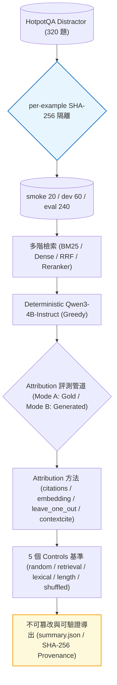

# rag-evidence-attribution-bench

[](https://github.com/kuotunyu/rag-evidence-attribution-bench/actions/workflows/ci.yml)


[](LICENSE)

本專案為針對 RAG (Retrieval-Augmented Generation) 脈絡歸因與證據依賴性 (Evidence Attribution & Faithfulness) 之可重現性評測框架。基於 **HotpotQA (distractor)** 數據集，對 **Qwen3-4B-Instruct** 的回答進行多維度歸因分析（包含可驗證之 Supporting Facts 比對、Sufficiency、Comprehensiveness、Latency 與 Peak VRAM），並配備防篡改 SHA-256 Fingerprint 與 Pipeline 機制。

> English version: [README_en.md](README_en.md)

---

## 評測基準說明

- **資料集分割 (Dataset Splits)**：採用 320 題 HotpotQA-distractor 數據，嚴格拆分為 `smoke` (20) / `dev` (60) / **`eval` (240 鎖定評測集)**，每個樣本皆經由 SHA-256 簽章固定 ([DATA_CARD.md](DATA_CARD.md))。
- **多階檢索 (Retrieval Pipeline)**：包含 BM25 關鍵字檢索、Dense 向量檢索 (Qwen3-Embedding-0.6B) 與 Hybrid RRF 重排序。
- **生成與歸因 (Generation & Attribution)**：採 Deterministic Greedy 解碼並輸出 `[P#]` 內文引用；支援 `citations`、`embedding`、`leave_one_out` (Causal Baseline)、`arc_jsd` 與 `contextcite` 方法，並加入 5 個對照組 Controls (Random / Retrieval-rank / Lexical / Length / Shuffled)。
- **雙重評測模式 (Dual Evaluation Modes)**：Mode A (Teacher-forced Gold Answers 全樣本) 與 Mode B (Generated Answers 僅針對答對子集計算)。
- **結構化防可捏造機制 (Structural Integrity)**：評測數據僅能透過真實硬體執行或 SHA-256 簽章驗證匯入，無法手動竄改結果。

---

## 系統架構



---

## 評測結果

三個 Split 均於真實硬體上完整執行並由 `summary.json` 自動推導生成。

<!-- BEGIN AUTOGENERATED RESULTS -->
**Retrieval 檢索結果**

| split | method | R@2 | R@5 | MRR | nDCG@10 | p50 ms | n |
|---|---|---|---|---|---|---|---|
| smoke | bm25 (cpu) | 0.650 | 0.725 | 0.852 | 0.832 | 1.0 | 20 |
| smoke | dense (cpu) | 0.625 | 0.850 | 0.874 | 0.849 | 54265.5 | 20 |
| smoke | hybrid_rrf (cpu) | 0.625 | 0.850 | 0.814 | 0.819 | 0.0 | 20 |
| dev | bm25 (cpu) | 0.600 | 0.742 | 0.861 | 0.821 | 1.1 | 60 |
| dev | dense (NVIDIA A100-SXM4-40GB) | 0.683 | 0.842 | 0.928 | 0.880 | 377.5 | 60 |
| dev | hybrid_rrf (NVIDIA A100-SXM4-40GB) | 0.675 | 0.842 | 0.957 | 0.885 | 0.1 | 60 |
| eval | bm25 (cpu) | 0.598 | 0.823 | 0.862 | 0.831 | 1.1 | 240 |
| eval | dense (NVIDIA A100-SXM4-40GB) | 0.694 | 0.885 | 0.930 | 0.888 | 1101.2 | 240 |
| eval | hybrid_rrf (NVIDIA A100-SXM4-40GB) | 0.667 | 0.887 | 0.927 | 0.886 | 0.1 | 240 |

**Generation 生成結果** (deterministic greedy)

| split | model | EM | F1 | cite-P | cite-R | cite-F1 | abstain | tok/s | peak VRAM MB | n |
|---|---|---|---|---|---|---|---|---|---|---|
| smoke | qwen3-4b (bfloat16) | 0.500 | 0.636 | 0.912 | 0.737 | 0.786 | 0.050 | 2.5 | 12120 | 20 |
| dev | qwen3-4b (bfloat16) | 0.433 | 0.547 | 0.892 | 0.802 | 0.816 | 0.117 | 20.0 | 8197 | 60 |
| eval | qwen3-4b (bfloat16) | 0.362 | 0.496 | 0.940 | 0.745 | 0.801 | 0.200 | 19.7 | 8437 | 240 |

**Attribution — mode A (teacher-forced gold answer), split `smoke`**
| method | F1@2 | AUPRC | nDCG@10 | sufficiency ↓ | comprehensiveness ↑ | s/sample | fail % | n |
|---|---|---|---|---|---|---|---|---|
| embedding | 0.750 | 0.841 | 0.906 | 1.551 | 4.939 | 13.105 | 0.0 | 20 |
| leave_one_out | 0.675 | 0.775 | 0.869 | 0.641 | 5.773 | 79.457 | 0.0 | 20 |
| control_length _(control)_ | 0.025 | 0.249 | 0.450 | 6.551 | 0.026 | 7.551 | 0.0 | 20 |
| control_lexical _(control)_ | 0.650 | 0.744 | 0.850 | 1.563 | 3.914 | 2.592 | 0.0 | 20 |
| control_random _(control)_ | 0.250 | 0.411 | 0.595 | 4.904 | 1.556 | 7.780 | 0.0 | 20 |
| control_retrieval _(control)_ | 0.650 | 0.734 | 0.832 | 1.562 | 4.272 | 4.129 | 0.0 | 20 |
| control_shuffled _(control)_ | 0.250 | 0.427 | 0.592 | 5.038 | 2.125 | 7.233 | 0.0 | 20 |

**Attribution — mode B (generated answer), split `smoke`**
_Agreement metrics 僅在答對子集計算: n_correct=10 of n_total=20 (criterion: em; abstained: 1)._

| method | F1@2 | AUPRC | nDCG@10 | sufficiency ↓ | comprehensiveness ↑ | s/sample | fail % | n |
|---|---|---|---|---|---|---|---|---|
| citations | 0.650 | 0.748 | 0.862 | 1.477 | 6.646 | 16.485 | 0.0 | 10 |
| contextcite | 0.750 | 0.836 | 0.908 | 0.974 | 5.841 | 78.280 | 5.3 | 10 |
| embedding | 0.700 | 0.823 | 0.902 | 2.124 | 5.290 | 2.277 | 0.0 | 10 |
| leave_one_out | 0.800 | 0.877 | 0.938 | 1.055 | 6.371 | 41.120 | 0.0 | 10 |
| control_length _(control)_ | 0.050 | 0.268 | 0.469 | 7.053 | 0.313 | 3.756 | 0.0 | 10 |
| control_lexical _(control)_ | 0.650 | 0.751 | 0.845 | 2.457 | 5.016 | 1.129 | 0.0 | 10 |
| control_random _(control)_ | 0.150 | 0.352 | 0.547 | 5.054 | 1.690 | 3.382 | 0.0 | 10 |
| control_retrieval _(control)_ | 0.600 | 0.665 | 0.765 | 2.226 | 5.275 | 2.097 | 0.0 | 10 |
| control_shuffled _(control)_ | 0.200 | 0.397 | 0.570 | 6.483 | 0.949 | 4.431 | 0.0 | 10 |

**Attribution — mode A (teacher-forced gold answer), split `dev`**
| method | F1@2 | AUPRC | nDCG@10 | sufficiency ↓ | comprehensiveness ↑ | s/sample | fail % | n |
|---|---|---|---|---|---|---|---|---|
| embedding | 0.817 | 0.885 | 0.938 | 0.669 | 5.742 | 0.241 | 0.0 | 60 |
| leave_one_out | 0.758 | 0.823 | 0.899 | -0.359 | 6.637 | 1.050 | 0.0 | 60 |
| control_length _(control)_ | 0.117 | 0.287 | 0.483 | 6.065 | 0.354 | 0.135 | 0.0 | 60 |
| control_lexical _(control)_ | 0.658 | 0.737 | 0.831 | 1.672 | 4.972 | 0.068 | 0.0 | 60 |
| control_random _(control)_ | 0.167 | 0.330 | 0.523 | 5.695 | 1.322 | 0.148 | 0.0 | 60 |
| control_retrieval _(control)_ | 0.600 | 0.707 | 0.821 | 2.315 | 4.006 | 0.096 | 0.0 | 60 |
| control_shuffled _(control)_ | 0.167 | 0.346 | 0.536 | 6.302 | 0.611 | 0.144 | 0.0 | 60 |

**Attribution — mode B (generated answer), split `dev`**
_Agreement metrics 僅在答對子集計算: n_correct=26 of n_total=60 (criterion: em; abstained: 7)._

| method | F1@2 | AUPRC | nDCG@10 | sufficiency ↓ | comprehensiveness ↑ | s/sample | fail % | n |
|---|---|---|---|---|---|---|---|---|
| citations | 0.788 | 0.868 | 0.926 | 1.854 | 6.742 | 0.262 | 0.0 | 26 |
| embedding | 0.808 | 0.890 | 0.944 | 1.982 | 6.971 | 0.086 | 0.0 | 26 |
| leave_one_out | 0.788 | 0.866 | 0.932 | 1.449 | 6.884 | 0.574 | 0.0 | 26 |
| control_length _(control)_ | 0.038 | 0.229 | 0.436 | 7.661 | 0.674 | 0.072 | 0.0 | 26 |
| control_lexical _(control)_ | 0.635 | 0.724 | 0.823 | 2.680 | 5.802 | 0.027 | 0.0 | 26 |
| control_random _(control)_ | 0.173 | 0.343 | 0.536 | 6.786 | 1.400 | 0.080 | 0.0 | 26 |
| control_retrieval _(control)_ | 0.673 | 0.753 | 0.851 | 3.465 | 5.350 | 0.047 | 0.0 | 26 |
| control_shuffled _(control)_ | 0.173 | 0.341 | 0.530 | 6.604 | 0.833 | 0.078 | 0.0 | 26 |

**Attribution — mode A (teacher-forced gold answer), split `eval`**
| method | F1@2 | AUPRC | nDCG@10 | sufficiency ↓ | comprehensiveness ↑ | s/sample | fail % | n |
|---|---|---|---|---|---|---|---|---|
| embedding | 0.812 | 0.894 | 0.940 | 1.604 | 6.249 | 0.254 | 0.0 | 240 |
| leave_one_out | 0.727 | 0.813 | 0.892 | -0.262 | 7.180 | 1.072 | 0.0 | 240 |
| control_length _(control)_ | 0.104 | 0.281 | 0.478 | 7.559 | 0.707 | 0.131 | 0.0 | 240 |
| control_lexical _(control)_ | 0.619 | 0.731 | 0.833 | 2.728 | 5.384 | 0.072 | 0.0 | 240 |
| control_random _(control)_ | 0.206 | 0.374 | 0.560 | 6.259 | 1.731 | 0.143 | 0.0 | 240 |
| control_retrieval _(control)_ | 0.598 | 0.722 | 0.831 | 3.330 | 5.099 | 0.100 | 0.0 | 240 |
| control_shuffled _(control)_ | 0.179 | 0.372 | 0.558 | 6.368 | 1.104 | 0.139 | 0.0 | 240 |

**Attribution — mode B (generated answer), split `eval`**
_Agreement metrics 僅在答對子集計算: n_correct=87 of n_total=240 (criterion: em; abstained: 48)._

| method | F1@2 | AUPRC | nDCG@10 | sufficiency ↓ | comprehensiveness ↑ | s/sample | fail % | n |
|---|---|---|---|---|---|---|---|---|
| citations | 0.753 | 0.844 | 0.915 | 1.582 | 6.727 | 0.257 | 0.0 | 87 |
| embedding | 0.816 | 0.900 | 0.945 | 2.521 | 6.555 | 0.091 | 0.0 | 87 |
| leave_one_out | 0.793 | 0.857 | 0.921 | 0.860 | 7.156 | 0.650 | 0.0 | 87 |
| control_length _(control)_ | 0.075 | 0.262 | 0.462 | 7.765 | 0.939 | 0.081 | 0.0 | 87 |
| control_lexical _(control)_ | 0.649 | 0.758 | 0.851 | 2.720 | 5.842 | 0.035 | 0.0 | 87 |
| control_random _(control)_ | 0.207 | 0.381 | 0.565 | 6.604 | 1.873 | 0.088 | 0.0 | 87 |
| control_retrieval _(control)_ | 0.615 | 0.742 | 0.846 | 3.473 | 5.547 | 0.062 | 0.0 | 87 |
| control_shuffled _(control)_ | 0.172 | 0.363 | 0.551 | 7.057 | 1.252 | 0.083 | 0.0 | 87 |

_由 `report` 根據 `results/derived/summary.json` 於 2026-07-25T08:30:49Z 自動產生。請勿手動編輯。_
<!-- END AUTOGENERATED RESULTS -->

---

## Cross-Encoder Reranking 延伸實驗

本延伸實驗評估重排序對檢索層級之改善，是否傳遞至 Citation Coverage、Sufficiency/Comprehensiveness 與最終 Faithfulness：

<!-- BEGIN AUTOGENERATED RERANKING EXTENSION -->
**受控 reranking extension**

Confirmatory configuration: candidate-k 10 (完整且固定的 Hotpot distractor candidate set), final context-k 5。Smoke/dev 不是正式 eval。

| split | arm | nDCG@5 | complete evidence@5 | EM | F1 | citation coverage | rerank p95 ms | retrieval e2e p95 ms | retrieval+generation p95 ms (est.) | pipeline peak VRAM MB |
|---|---|---|---|---|---|---|---|---|---|---|
| smoke | bm25 | 0.724 | 0.550 | 0.350 | 0.509 | 0.500 | — | 1.4 | 3661.7 | 7726.4 |
| smoke | dense | 0.790 | 0.750 | 0.350 | 0.493 | 0.450 | — | 135512.8 | 141259.9 | 8523.3 |
| smoke | hybrid_rrf | 0.760 | 0.750 | 0.400 | 0.559 | 0.575 | — | 135512.9 | 136758.9 | 8519.2 |
| smoke | hybrid_rrf_rerank | 0.895 | 0.850 | 0.500 | 0.633 | 0.475 | 7368.4 | 143017.2 | 143960.6 | 8601.0 |
| dev | bm25 | 0.724 | 0.517 | 0.350 | 0.417 | 0.500 | — | 1.4 | 4772.9 | 8709.7 |
| dev | dense | 0.820 | 0.700 | 0.400 | 0.479 | 0.592 | — | 605.1 | 3945.4 | 8294.3 |
| dev | hybrid_rrf | 0.825 | 0.700 | 0.383 | 0.473 | 0.625 | — | 605.2 | 5863.9 | 8709.7 |
| dev | hybrid_rrf_rerank | 0.954 | 0.967 | 0.500 | 0.597 | 0.675 | 42.9 | 633.2 | 5768.7 | 8332.5 |
| eval | bm25 | 0.762 | 0.679 | 0.346 | 0.454 | 0.496 | — | 1.7 | 5250.4 | 9535.2 |
| eval | dense | 0.843 | 0.779 | 0.346 | 0.462 | 0.525 | — | 2011.5 | 5692.6 | 8476.5 |
| eval | hybrid_rrf | 0.842 | 0.787 | 0.362 | 0.484 | 0.529 | — | 2011.5 | 7705.9 | 8577.9 |
| eval | hybrid_rrf_rerank | 0.938 | 0.917 | 0.375 | 0.509 | 0.562 | 67.7 | 2054.4 | 6429.3 | 8723.5 |

_所有數值皆由 `results/reranking/derived/*/reranking_comparison.json` 自動產生。_
<!-- END AUTOGENERATED RERANKING EXTENSION -->

---

## 快速開始

需求：Python 3.11、`uv`。

### 1. 本地評測與數據匯入

```bash
# 1. 安裝環境與依賴
uv sync --extra ml --extra app

# 2. 執行評測管線 (CPU)
python -m rag_evidence.cli data prepare --config configs/smoke.yaml
python -m rag_evidence.cli retrieve --method bm25       --config configs/smoke.yaml
python -m rag_evidence.cli retrieve --method dense      --config configs/smoke.yaml
python -m rag_evidence.cli retrieve --method hybrid_rrf --config configs/smoke.yaml
python -m rag_evidence.cli evaluate --config configs/smoke.yaml
python -m rag_evidence.cli report   --config configs/smoke.yaml

# 3. 啟動預計算結果 Explorer 與 API (開啟 http://127.0.0.1:8000/)
docker compose up
```

---

## GPU 執行與重現步驟

若需於硬體上重現 GPU 生成與歸因步驟：

1. 執行 `uv run python scripts/make_colab_bundle.py` 產出 `reab_bundle.zip`。
2. 上傳至 [notebooks/01_colab_run.ipynb](notebooks/01_colab_run.ipynb) 進行 A100 推理。
3. 匯入結果至本機：`python -m rag_evidence.cli import-results <zip> --config <cfg>` 並執行 `evaluate` 與 `report`。

---

## 命令列工具規格

```bash
python -m rag_evidence.cli data prepare   --config <cfg>
python -m rag_evidence.cli retrieve       --method bm25|dense|hybrid_rrf|hybrid_rrf_rerank --config <cfg> [--resume]
python -m rag_evidence.cli generate       --config <cfg> [--resume]
python -m rag_evidence.cli attribute      --method citations|embedding|leave_one_out|arc_jsd|contextcite|control_* --config <cfg> [--mode gold|generated] [--resume]
python -m rag_evidence.cli evaluate       --config <cfg> [--allow-partial]
python -m rag_evidence.cli report         --config <cfg>
python -m rag_evidence.cli serve          --config <cfg>
python -m rag_evidence.cli status|export  --config <cfg>
python -m rag_evidence.cli import-results <zip> --config <cfg>
```

---

## 專案文件導覽

- [DATA_CARD.md](DATA_CARD.md) — 資料集說明、Splits 拆分、SHA-256 簽章與授權
- [MODEL_CARD.md](MODEL_CARD.md) — 模型規格、Decoding 政策與歸因演算法定義
- [FAILURES.md](FAILURES.md) — 實測異常現象與 Fallback 分析
- [TRANSFER.md](TRANSFER.md) — 硬體移機與 CUDA Opt-in 步驟
