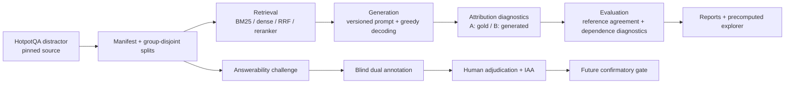

# RAG Evidence Attribution Bench

[](https://github.com/kuotunyu/rag-evidence-attribution-bench/actions/workflows/ci.yml)
[](https://github.com/kuotunyu/rag-evidence-attribution-bench/releases/tag/v0.1.0)
[](pyproject.toml)
[](LICENSE)

A reproducible, auditable RAG benchmark for comparing retrieval, generation, and diagnostics of which candidate evidence an answer depends on.

[中文](README.md) · [full historical v0.1 evidence](docs/HISTORICAL_V01_EVIDENCE_EN.md) · [Dataset v2](docs/DATASET_V2.md) · [Challenge v1](docs/CHALLENGE_V1.md)

## Honest boundary

This repository contains two layers that must not be conflated:

- `v0.1.0` is the published, reproducible historical closed-candidate descriptive baseline.
- Dataset v2 and the 960-item Answerability Challenge are follow-on engineering candidates on `main`.
- The v2 confirmatory benchmark has not been executed.
- The 640 missing-hop/evidence-swap candidates still require two independent annotators and a third adjudicator for disagreements.
- There is no formal v2 model output, confirmatory effect estimate, or v1.0 flagship claim.

The benchmark measures behavior inside each fixed HotpotQA distractor candidate set. It is
not an open-corpus retrieval benchmark. Passage agreement is reference agreement: it is
not causal ground truth and is not complete faithfulness.

`leave_one_out` is a deletion-based teacher-forced target-dependence diagnostic.
`arc_jsd` is an experimental distributional-dependence diagnostic. Sufficiency and
comprehensiveness remain diagnostics until construct validation passes.

## Key results: historical v0.1

These numbers come from committed v0.1 artifacts. They remain useful closed-candidate
descriptive results, but do not support open-corpus or causal generalization.

### Retrieval (eval, n=240)

| method | Recall@2 | Recall@5 | MRR | nDCG@10 |
|---|---:|---:|---:|---:|
| BM25 | 0.598 | 0.823 | 0.862 | 0.831 |
| Dense | 0.694 | 0.885 | 0.930 | 0.888 |
| Hybrid RRF | 0.667 | 0.887 | 0.927 | 0.886 |

### Generation (eval, n=240)

| model | EM | F1 | citation precision | citation recall | abstain rate |
|---|---:|---:|---:|---:|---:|
| Qwen3-4B Instruct, greedy | 0.362 | 0.496 | 0.940 | 0.745 | 0.200 |

### Defensible attribution interpretation

- Mode A fixes the official gold answer and measures target-score dependence under passage removal.
- Mode B fixes the model's own generated answer before attribution.
- Supporting-fact metrics are reference agreement, not mechanism-level ground truth.
- v0.1 eval lacks Dataset v2 title/paragraph group isolation.
- Complete split, method, control, uncertainty, and secondary tables remain in the
  [historical evidence document](docs/HISTORICAL_V01_EVIDENCE_EN.md).

<!-- RESULTS:BEGIN -->
Complete machine-generated historical v0.1 tables moved to
[`docs/HISTORICAL_V01_EVIDENCE_EN.md`](docs/HISTORICAL_V01_EVIDENCE_EN.md).
This homepage retains the verified summary most useful for understanding the engineering scope.
<!-- RESULTS:END -->

## Architecture



Core engineering rules:

1. Dataset source, revision, split, prompt, and scientific configuration are hash-bound.
2. JSONL stages are append-only and resumable and reject scientific-config mismatches.
3. Fake-backend and real runs are isolated by `execution_kind`.
4. Reports render real artifacts only; mock output cannot enter homepage results.
5. v1/v2, natural/challenge, and pilot/confirmatory namespaces never overwrite one another.
6. GPU/model imports are lazy; the precomputed explorer runs in a CPU-only container.

## Methods

### Retrieval

| method | role | implementation note |
|---|---|---|
| `bm25` | sparse baseline | fixed Hotpot distractor candidates |
| `dense` | semantic retrieval | Qwen3-Embedding-0.6B |
| `hybrid_rrf` | rank fusion | deterministic reciprocal-rank fusion |
| `hybrid_rrf_rerank` | controlled extension | pinned bge-reranker-v2-m3 |

### Generation

- Generator: `Qwen/Qwen3-4B-Instruct-2507`.
- Decoding: greedy, `do_sample=False`, `num_beams=1`.
- Prompt v1: passage citations `[P#]`, retained for historical compatibility.
- v2 contract: sentence citations `[P#.S#]`, used only by new runs.
- Abstention: `INSUFFICIENT EVIDENCE`.
- Each run records prompt hash, dtype, quantization, runtime, and hardware metadata.

### Attribution diagnostics

| method | interpretation | modes |
|---|---|---|
| `citations` | model self-report reference | generated |
| `embedding` | question/answer-to-passage similarity | gold + generated |
| `leave_one_out` | deletion-based target dependence | gold + generated |
| `arc_jsd` | experimental distributional dependence | gold + generated |
| `contextcite` | optional surrogate regeneration | generated |
| `oracle_gold` | construct positive control | gold + generated |
| `control_random` | null control | gold + generated |
| `control_answer_string` | lexical construct control | gold + generated |
| `control_lexical` | question-answer lexical baseline | gold + generated |

### Metrics

- Retrieval: Recall@k, MRR, and nDCG@10.
- Generation: EM, token F1, abstention, and citation precision/recall/F1.
- Attribution: precision/recall/F1@k, MAP, and nDCG@10.
- Dependence diagnostics: sufficiency and comprehensiveness.
- Uncertainty: paired or cluster bootstrap, depending on the protocol sampling unit.
- Annotation: raw agreement, Cohen's kappa, Krippendorff's alpha, and evidence-set overlap.

## Dataset v2 and answerability challenge

Dataset v2 pins HotpotQA revision
`1908d6afbbead072334abe2965f91bd2709910ab` and allocates connected components of
normalized titles and paragraph fingerprints to group-disjoint splits.

| split | questions | groups | bridge | comparison | role |
|---|---:|---:|---:|---:|---|
| smoke | 20 | 15 | 16 | 4 | tooling smoke |
| dev | 60 | 42 | 48 | 12 | development |
| eval | 240 | 128 | 192 | 48 | frozen public candidate |

Challenge v1 creates three deterministic transformations per parent:

| transformation | records | current gate |
|---|---:|---|
| answer-bearing distractor | 320 | engineering-eligible; primary use still needs protocol |
| missing hop | 320 | pending two independent humans |
| evidence swap | 320 | pending two independent humans |

The 960 rows are not 960 independent experimental units. Variants are nested within
parents, and parents belong to leakage groups. Formal analysis must preserve that hierarchy.

## Annotation-ready plan

- [Pilot protocol](PILOT_PROTOCOL.md): 20 parents; tests instructions, UI, time, and disagreement reasons only.
- [Confirmatory draft](PREREGISTRATION_V2_CONFIRMATORY_DRAFT.md): proposed 160 eval parents; visibly DRAFT.
- Pilot rows never enter the confirmatory primary analysis.
- Codex, LLMs, and rule systems cannot produce human decisions or adjudicate automatically.
- Formal eligibility needs two independent annotators and a third independent adjudicator on disagreement.
- IAA below 0.70 blocks protocol promotion.
- Formal endpoints, exclusions, and the multiplicity family freeze before model output.

## Reproducibility

### CPU-only setup

```powershell
git clone https://github.com/kuotunyu/rag-evidence-attribution-bench.git
cd rag-evidence-attribution-bench
uv sync --frozen --extra app
uv run rag-evidence --help
uv run pytest -m "not gpu and not slow" -q
```

On Windows, use an ASCII-only checkout/worktree path. A non-ASCII parent path can make an
editable `.pth` fail under a CP950 startup locale.

### Data preparation

```powershell
uv sync --frozen --extra ml --extra app
uv run rag-evidence data prepare --config configs/v2/smoke.yaml
uv run rag-evidence data challenge --config configs/v2/eval.yaml
```

These commands rebuild pinned data artifacts only. They do not complete human review or a
confirmatory run.

### Historical pipeline surface

```powershell
uv run rag-evidence retrieve --method bm25 --config configs/smoke.yaml
uv run rag-evidence generate --config configs/smoke.yaml
uv run rag-evidence attribute --method leave_one_out --config configs/smoke.yaml
uv run rag-evidence evaluate --config configs/smoke.yaml
uv run rag-evidence report --config configs/smoke.yaml
uv run rag-evidence serve --config configs/full.yaml
```

`generate` and model-based attribution are GPU stages and are not run by the regular CI.

### Docker explorer

```powershell
docker compose up --build explorer
```

The explorer reads precomputed artifacts only. Its image enables Hugging Face offline flags
and cannot download a model.

## Tests and CI

CI fixes the following checks:

- `uv sync --frozen`
- Ruff formatting check
- Ruff lint
- strict mypy over `src`
- non-GPU/non-slow pytest with coverage
- CPU Docker build
- `/health` and `/methods` probes

Full local checks:

```powershell
uv run ruff format --check .
uv run ruff check .
uv run mypy src
uv run pytest -m "not gpu and not slow" -q
uv build
```

## Limitations

1. v0.1 is a fixed-candidate benchmark and does not estimate open-corpus retrieval quality.
2. v0.1 splits lack v2 group isolation, so eval remains descriptive.
3. HotpotQA supporting facts may be incomplete or redundant.
4. Passage deletion may induce distribution shift and does not identify a causal effect alone.
5. Reference agreement is not complete faithfulness.
6. Mode B agreement is selected by generator correctness.
7. ARC-JSD has not completed validation against the official reference implementation.
8. The ContextCite adapter attributes its own regeneration, creating a stored-target mismatch.
9. Dataset v2 is a public frozen candidate, not a permanently blind test set.
10. Independent humans have not finished answerability review of negative transforms.
11. There is no formal v2 effect estimate, IAA result, or adjudicated eligibility artifact.
12. The MIT software license does not replace CC BY-SA 4.0 duties for embedded HotpotQA text.

## Repository map

```text
src/rag_evidence/       benchmark package
configs/                v0.1, v2, and reranking configs
data/manifests/         immutable split/challenge manifests
results/                committed raw/derived evidence
tests/                  offline synthetic and contract tests
docs/                   methods, dataset, and historical evidence
notebooks/              explicit GPU workflows
app/                    precomputed explorer entrypoint
```

## Detailed evidence

- [Full historical v0.1 results and methods](docs/HISTORICAL_V01_EVIDENCE_EN.md)
- [Historical evidence in Chinese](docs/HISTORICAL_V01_EVIDENCE_ZH.md)
- [MODEL_CARD.md](MODEL_CARD.md)
- [DATA_CARD.md](DATA_CARD.md)
- [Dataset v2](docs/DATASET_V2.md)
- [Answerability Challenge v1](docs/CHALLENGE_V1.md)
- [Pilot protocol](PILOT_PROTOCOL.md)
- [Confirmatory preregistration draft](PREREGISTRATION_V2_CONFIRMATORY_DRAFT.md)
- [Reranking preregistration](PREREGISTRATION_RERANKING.md)
- [Reranking secondary analysis](SECONDARY_ANALYSIS_RERANKING.md)
- [Known failures](FAILURES.md)
- [Approved B0 design](docs/superpowers/specs/2026-08-23-v02-annotation-readiness-design.md)

## License and attribution

Code is MIT licensed. Artifacts containing HotpotQA questions/passages remain CC BY-SA 4.0
with attribution to Yang et al. (2018). Qwen and the pinned reranker are Apache-2.0 models;
see [DATA_CARD.md](DATA_CARD.md) and [MODEL_CARD.md](MODEL_CARD.md) for boundaries.

## Current status

`v0.1.0` remains the historical release. The v0.2 branch is annotation-readiness
engineering only. Human pilot, protocol freeze, confirmatory sampling, real model execution,
formal statistics, tagging, release, and v1.0 claims all require separate approval.
