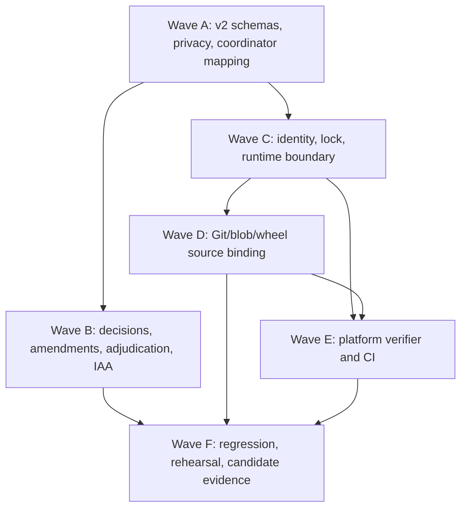

# Breaking v2 Source-Bound Handoff Plan Index

> **For agentic workers:** REQUIRED SUB-SKILL: Use superpowers:executing-plans to implement
> this suite task-by-task. Every production change follows superpowers:test-driven-development.

**Goal:** Replace the decision-bearing annotation v1 handoff with the approved group-free v2
pipeline and close an exact-source, Windows/Linux-verified, Git-external pilot handoff without
starting a human pilot.

**Architecture:** The existing v1 annotation implementation is replaced in six dependency-ordered
waves. Human-visible models and APIs are group-free; a separate external coordinator manifest owns
the only group mapping. Source, wheel, platform, and kit verification are isolated modules joined by
strict hashes and receipts.

**Tech Stack:** Python 3.11, Pydantic 2, FastAPI, Typer, uv/Hatch, hashed pip requirements,
pytest, Ruff, strict mypy, Git, ZIP/RECORD verification, PowerShell 7, POSIX shell, GitHub Actions,
and Docker.

## Approved authority

- Approved design: `docs/superpowers/specs/2026-08-24-rag-evidence-v2-source-bound-handoff-design.md`
- Approved spec commit: `e5452f7c76b660e189f5920e5fe539b2e86d34b9`
- Implementation branch: `codex/v0.2-annotation-readiness`
- Pull request: `https://github.com/kuotunyu/rag-evidence-attribution-bench/pull/3`
- Commit identity: `kuotunyu <61350295+kuotunyu@users.noreply.github.com>`

## Global constraints

- Python distribution is exactly `0.2.0.dev0`; protocol is `pilot-v0.2.2-draft`; schema names
  are the distinct `*-v2` values from the approved design.
- Every v1 annotation, assignment, amendment, adjudication, eligibility, aggregate, handoff, or
  platform artifact fails closed. There is no migration path.
- Human-visible artifacts contain no parent/group/sibling field, `bg-*` value, transformation,
  expected/gold label, source provenance, score, seed, or coordinator mapping.
- The external coordinator manifest is deterministic, Git-external, coordinator-only, and binds
  exactly 40 tasks, 20 groups, two variants per group, two annotators per task, non-adjacent sibling
  order, and the two canonical package hashes.
- Claims are limited to explicit metadata, transformation-label, and expected-label blinding plus
  non-adjacent scheduling. Semantic unlinkability and independent sibling perception are disclaimed.
- Runtime bootstrap is online and hash-locked; runtime is loopback-only. No air-gap, sandbox, or
  complete network-isolation claim is permitted.
- Final evidence uses two new external disposable detached checkouts. Tracked/untracked and ignored
  output must be zero bytes before and after builds; all environments, caches, builds, and wheels
  remain outside each checkout.
- Both supplied wheels and both replay wheels must be byte-identical. No per-build fallback exists.
- Windows and Linux receipts and exact-candidate CI jobs are mandatory.
- Wheels, sdists, kits, private manifests, receipts, smoke state, and decisions remain outside Git.
- Do not start a human pilot, create human scientific labels, merge, tag, release, publish, mutate
  historical v0.1 evidence, delete retained old candidate evidence, or weaken the approved design.

## Dependency graph

## Plan suite

1. [Wave A — schemas, privacy projection, coordinator mapping](2026-08-24-breaking-v2-wave-a.md)
2. [Wave B — submission through IAA](2026-08-24-breaking-v2-wave-b.md)
3. [Wave C — distribution identity, dependency lock, runtime boundary](2026-08-24-breaking-v2-wave-c.md)
4. [Wave D — Git/blob/wheel source-bound builder](2026-08-24-breaking-v2-wave-d.md)
5. [Wave E — Windows/Linux verifier and CI](2026-08-24-breaking-v2-wave-e.md)
6. [Wave F — full regression, rehearsal, and candidate closure](2026-08-24-breaking-v2-wave-f.md)

## Execution order and invalidation

Each task ends in a reviewable commit. Focused RED and GREEN output is retained in the session
transcript. After Wave F selects the final source commit, any source change invalidates all prior
wheels, receipts, CI candidate status, platform artifacts, kits, and handoff receipt; repeat the
candidate sequence from clean checkout creation.

The only successful terminal state is:

`PR OPEN / CI GREEN / HUMAN_PILOT_NOT_STARTED / PILOT_READY_FOR_SEPARATE_AUTHORIZATION`

## Plan self-review record

- **Spec coverage:** PASS. Every version/schema, privacy, coordinator mapping, workflow, bootstrap,
  runtime, source/wheel, platform, CI, rehearsal, and external-handoff requirement maps to a named
  task and verification command.
- **Placeholder scan:** PASS. No deferred implementation marker or unnamed error-handling step
  remains.
- **Type/schema consistency:** PASS after aligning `scan_delivery_tree`, `BlindTaskV2`,
  `AssignmentManifestV2`, `PlatformVerificationReceiptV2`, and all CLI producer/consumer names.
- **Version identity:** PASS. Historical v0.1, `pilot-v0.2.2-draft`, `*-v2`, `0.2.0.dev0`, and
  future final `0.2.0` remain distinct.
- **Build-order cycle:** PASS. Source-only manifest hashes are refreshed before the final commit;
  wheels and platform receipts are downstream; final handoff evidence is never a commit input.
- **Windows/Linux parity:** PASS. Both CI jobs execute the same bootstrap, install, runtime,
  loopback, export, and receipt semantics.
- **v1 fail-closed coverage:** PASS. Schema, API, collection, adjudication, finalization, handoff,
  platform, and static-delivery boundaries all have rejection tests.
- **Privacy claim boundary:** PASS. Only explicit metadata/transformation/expected-label blinding is
  asserted; semantic unlinkability and independent sibling perception are disclaimed.
- **Source/wheel/receipt binding:** PASS. Two clean checkouts, four identical wheels, Git blobs,
  RECORD/METADATA, both platform receipts, coordinator package hashes, and final kits are chained.
- **No human pilot execution:** PASS. Only invented synthetic fixtures may contain decisions; the
  terminal action is a separate-authorization readiness report.
