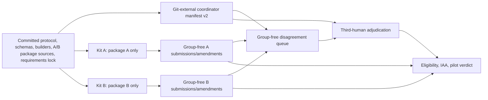

# RAG Evidence v2 Source-Bound Handoff Design

**Status:** Owner-review draft. Approved only for specification work on 2026-08-24.
**Repository:** `kuotunyu/rag-evidence-attribution-bench`
**Branch:** `codex/v0.2-annotation-readiness`
**Design baseline:** `58c8caa09295b33bfb9e6a27afade4b6160d0ccc`

This document specifies the breaking v2 privacy, build-attestation, dependency-bootstrap,
and runtime boundaries required before B0.1 may return to owner review. It does not authorize
implementation, an independent-human pilot, a merge, a tag, a release, or publication.

## Goals and non-goals

The design has four goals:

1. Remove explicit sibling, parent, transformation, and expected-label metadata from every
   human-visible annotation and adjudication path.
2. Preserve coordinator-only grouping so the 40-task feasibility pilot remains scheduled with
   sibling variants non-adjacent and every task remains assigned to two independent humans.
3. Make a handoff fail closed unless two clean checkouts of one real Git commit produce the same
   wheel bytes and both required target platforms produce source-, wheel-, and lock-bound verification
   receipts from actual commands.
4. Replace the contradictory offline-install claim with an online, hash-locked bootstrap followed
   by a loopback-only local annotation runtime.

This design does not make sibling content semantically unlinkable. Both pilot annotators still see
both variants of each of 20 parents, and sibling variants share the same question. It also does not
add group-aware multi-annotator allocation, OIDC signatures, SLSA provenance, a cryptographically
authenticated CI attestation, or a new public benchmark claim.

## Version and identity matrix

These identities are deliberately independent. No value below implies a Git tag or public release.

| Identity | v0.2.2 design value | Meaning |
|---|---|---|
| Pilot protocol/instruction | `pilot-v0.2.2-draft` | Human instructions and pilot operating rules |
| Visible task | `blind-task-v2` | Group-free task delivered to a human |
| Delivery package | `assignment-package-v2` | One annotator's ordered task package |
| Coordinator manifest | `assignment-manifest-v2` | External coordinator-only task/group/assignment mapping |
| Local draft | `annotation-draft-v2` | Replaceable local state bound to a v2 task |
| Answerability decision | `answerability-annotation-v2` | Immutable returned human decision |
| Citation decision | `citation-annotation-v2` | Group-free citation record if that workflow is used later |
| Amendment | `annotation-amendment-v2` | Append-only replacement of a v2 decision |
| Disagreement case | `disagreement-case-v2` | Group-free adjudicator-visible case |
| Adjudication | `adjudication-v2` | Third-human decision over two v2 originals |
| Eligibility record/artifact | `eligibility-record-v2`, `eligibility-artifact-v2` | Derived coordinator-only eligibility output |
| Collection receipt/input manifest | `annotation-collection-receipt-v2`, `annotation-input-manifest-v2` | Coordinator collection accounting and digests |
| Pilot aggregate outputs | `pilot-iaa-v2`, `pilot-evidence-agreement-v2`, `pilot-privacy-scan-v2`, `pilot-verdict-v2`, `pilot-timing-summary-v2`, `pilot-flow-accounting-v2`, `pilot-finalization-input-manifest-v2` | Derived v2 pilot evidence |
| Annotation/adjudication UI | `annotation-ui-v2`, `adjudication-ui-v2` | Human-facing API/UI contract |
| Handoff manifest/spec/builder | `handoff-manifest-v2`, `handoff-spec-v2`, `handoff-builder-v2` | Source-controlled handoff contract |
| Platform verification receipt | `platform-verification-receipt-v2` | Verifier-generated Windows or Linux execution evidence |
| External handoff receipt | `handoff-receipt-v2` | Final source/wheel/platform-bound coordinator evidence |
| Python distribution | `0.2.0.dev0` | Private breaking-v2 engineering wheel identity; not the pilot protocol or schema version |
| Git tag/release | none | A future owner decision, outside B0.1 |

All v1 annotation, package, manifest, amendment, adjudication, eligibility, collection, pilot-output,
and handoff schemas are invalid inputs to the v0.2.2 pipeline. Loaders fail closed on a v1 literal;
there is no migration or compatibility branch because no real human v1 data exists. The generic
Dataset v2 and historical v0.1 result formats are separate systems and are not renamed by this work.

The public historical baseline already owns Python distribution identity `0.1.0`. The breaking-v2
pilot wheel therefore uses `0.2.0.dev0`, and future implementation must keep that exact value
synchronized across `pyproject.toml`, `src/rag_evidence/__init__.py`, wheel `METADATA`, CLI version
output, tests, the handoff spec and external handoff receipt, and both platform receipts. The pilot
protocol `pilot-v0.2.2-draft`, all `*-v2` schema identities, Python distribution `0.2.0.dev0`, and
any future Git tag or release are distinct namespaces and must never be inferred from one another.

`0.2.0.dev0` authorizes neither a Git tag, GitHub Release, nor public package publication. A future
change to final distribution version `0.2.0` requires separate owner approval and a new exact-source
evidence build; no wheel, receipt, platform receipt, or checksum generated for `0.2.0.dev0` may be
relabelled or reused as final `0.2.0` evidence.

## Audience and artifact boundary

| Artifact | Source-controlled | Annotator A | Annotator B | Adjudicator | Coordinator only |
|---|---:|---:|---:|---:|---:|
| Canonical `ann-pilot-a.json` | yes | yes | no | no | yes |
| Canonical `ann-pilot-b.json` | yes | no | yes | no | yes |
| Coordinator manifest instance | no | no | no | no | yes |
| Coordinator manifest schema and deterministic builder | yes | no | no | no | yes |
| Submission/amendment return streams | no | own stream only | own stream only | no | yes |
| Group-free disagreement/adjudication payload | no | no | no | yes | yes |
| Requirements lock, runbook, onboarding, verified wheel | lock/docs only | yes | yes | as separately staged | yes |
| Windows/Linux platform receipts | no | no | no | no | yes |
| Root handoff receipt and checksum inventory | no | no | no | no | yes |

The source-controlled A/B package files are decision-free public build sources. The concrete
`assignment-manifest-v2` instance is generated deterministically into a Git-external coordinator
directory after the candidate commit is fixed. Only its schema and builder are committed. Its
group mapping is never copied into either delivery kit, a returned stream, an adjudication payload,
or an external handoff receipt field.

The committed handoff manifest calls Windows and Linux `required_verification_platforms`; it does
not call either platform supported or verified. Only the downstream external handoff receipt may
list `verified_platforms`, and the builder populates that field only after validating one Windows
and one Linux platform receipt for the exact candidate.

Each final kit has a closed layout: the one verified wheel, its own A or B package, the annotation
requirements lock, onboarding, runbook, its own PowerShell and POSIX launcher names, and its own
`SHA256SUMS`. It has no other package, coordinator manifest, platform receipt, root handoff receipt,
smoke artifact, or decision/state file.

## Breaking v2 privacy architecture

### Visible task and delivery package

`BlindTaskV2` contains exactly:

- `schema_version`
- `annotation_task_id`
- `challenge_id`
- `instruction_version` and `instruction_hash`
- visible `question` and aliased `passages`
- `task_content_hash`
- `assignment_batch`

It contains no parent ID, parent fingerprint, group token, sibling ID, transformation identity,
expected answerability, provenance, source record, score, seed, or coordinator mapping. The
`task_content_hash` is computed only over `challenge_id`, the instruction binding, the visible
question, and visible passages. It therefore neither contains nor indirectly commits to group
identity. `annotation_task_id`, `challenge_id`, and `task_content_hash` are unique per task;
`instruction_version`, `instruction_hash`, and `assignment_batch` are global to all 40 tasks and
cannot encode a two-task equivalence class.

`AssignmentPackageV2` contains one opaque annotator pseudonym, the global instruction and batch
bindings, and an ordered tuple of `BlindTaskV2`. It does not contain a seed or grouping map.

### Coordinator-only manifest and scheduling

`AssignmentManifestV2` is a strict external coordinator artifact. It contains:

- the manifest schema, deterministic seed, protocol binding, and assignment batch;
- each `BlindTaskV2` once;
- for each task, an internal coordinator group ID, internal transformation identity, the two
  assigned opaque annotator pseudonyms, and each annotator's delivery-order position;
- package hashes sufficient to bind the private mapping to the two committed delivery packages.

The pilot-specific validator requires exactly 40 unique tasks, exactly 20 internal groups, exactly
two different transformation variants per group, exactly two distinct annotators per task, and no
adjacent tasks from one internal group in either delivery order. Generic assignment helpers retain
their smaller-fixture capability, but the pilot build entry point applies the exact 40/20/two
constraints.

Scheduling consumes `(BlindTaskV2, internal_group_id)` pairs before delivery packages are emitted.
The scheduler never reads a group field from a visible task because no such field exists. The
private manifest is regenerated after the final candidate commit and its package hashes must match
the committed A/B bytes before coordinator use.

### Decisions, amendments, collection, and adjudication

`AnswerabilityAnnotationV2` binds a decision with only:

- `annotation_task_id`
- `challenge_id`
- `task_content_hash`
- `instruction_version` and `instruction_hash`
- `assignment_batch`
- assigned `annotator_pseudonym`
- the answerability, answer, evidence, ambiguity, defect, confidence, rationale, and UTC timing
  fields required by the protocol.

The local store and coordinator validate the exact owner-specified binding tuple:
`annotation_task_id`, `challenge_id`, `task_content_hash`, `instruction_version`,
`instruction_hash`, `assignment_batch`, and `annotator_pseudonym`. They never request or return a
parent/group value.

`AnnotationAmendmentV2` contains a v2 replacement and the immutable original/predecessor hashes.
It may not change any binding field. Resolution remains order-independent and fails on missing,
forked, cyclic, cross-original, duplicate-ID, or duplicate-hash chains.

`DisagreementCaseV2` and `AdjudicationV2` contain the task and challenge IDs, two complete v2
originals, disagreement reasons, third-human identity, final decision, exclusion, rationale, and
UTC time. They contain no group mapping. The adjudication UI looks up visible task content from the
private manifest but projects only `BlindTaskV2`; the private binding is not serialized into its
API response or HTML/JavaScript state. The adjudicator must differ from both original annotators.

Eligibility and finalization use task/challenge IDs and source artifact hashes. Adjudicated values
remain excluded from IAA, which is computed over exactly 40 complete, post-amendment and
pre-adjudication pairs. Both nominal Cohen kappa and nominal Krippendorff alpha must be finite and
at least 0.70.

### Fail-closed scanning

Structured delivery scanners reject:

- all v1 schema literals;
- keys naming or containing parent, group, sibling, transformation identity, expected/gold label,
  provenance, source identity, coordinator mapping, internal seed, score, or method metadata;
- values matching internal group identifiers such as `bg-*` or coordinator group IDs;
- internal challenge passage/sentence IDs, private filesystem paths, and PII-like values.

The scanner uses an allowlist for v2 model fields in addition to the denylist. Natural question
and passage prose is not rejected merely for containing ordinary words such as “parent”; only
metadata keys, reserved identifier patterns, and hidden-source values are prohibited.

A separate static delivery scan covers committed A/B package sources, staged kits, UI HTML and
JavaScript, API fixtures, submissions, amendments, exports, adjudication artifacts, platform and
handoff receipts, onboarding, launchers, and runbooks. It rejects literal hidden field names,
reserved ID patterns, concrete transformation labels, coordinator paths, private artifacts, and
incorrect blinding claims. The design specification and coordinator-only source code are not
delivery artifacts and may name the fields they are designed to prohibit.

Tests prove that per-task metadata in one package has no value occurring exactly twice: the three
task-specific identifiers/hashes are unique, while protocol and batch values occur for all 40
tasks. This proves that equality or shared-token inspection of kit-only metadata cannot reconstruct
the 20 pairs. It does not claim cryptographic unlinkability against a party with the repository or
that task content is semantically unlinkable.

## Honest blinding and scientific claim boundary

The v0.2.2 pilot may claim only:

- explicit coordinator metadata is blinded from annotators and the adjudicator;
- transformation labels are blinded;
- expected-answerability labels are blinded;
- sibling variants are scheduled non-adjacently using a coordinator-only mapping.

It must not claim fully sibling-blind evaluation, independent sibling perception, or `semantic unlinkability`.
An annotator may infer that two non-adjacent tasks are related because both variants
share the same question and may share visible passage content. Both annotators receive both variants
of all 20 parents, so their decisions do not satisfy a design in which one human never sees two
variants of the same parent.

The pilot remains tooling and instruction feasibility evidence only, is ineligible for primary
analysis, and cannot estimate a model, retrieval, generation, attribution, or transformation effect.
Any future confirmatory study requiring independent sibling perception needs a separately approved,
group-aware multi-annotator allocation in which no annotator sees more than one variant from a
parent.

## Data flow



Only the coordinator-side arrows may carry the internal group mapping. Every arrow leaving a human
kit or human UI carries v2 group-free records.

## Source-bound reproducible handoff

### Git identity verification

`handoff-builder-v2` receives two distinct checkout roots, two wheel paths, the committed
`handoff-manifest-v2`, the requested source commit, one Windows platform receipt, one Linux platform
receipt, and a new external output directory. Final evidence may use only two newly created,
disposable, detached checkouts at the exact candidate commit. Both checkout roots must be in an
external temporary location, not the active development worktree or any reused checkout.

For each checkout, the builder executes Git without a shell and fails unless all identity checks and
both the pre-build and post-build cleanliness gates pass:

1. `git rev-parse --verify <requested>^{commit}` resolves to the exact requested 40-character SHA.
2. `git rev-parse HEAD` equals that SHA.
3. `git rev-parse <SHA>^{tree}` produces the same tree SHA in both checkouts.
4. `git status --porcelain=v1 --untracked-files=all -z` produces zero bytes, proving that tracked
   status and the complete untracked-file set are both empty.
5. `git ls-files --others --ignored --exclude-standard -z` produces zero bytes, proving that the
   ignored-file set is empty.
6. The handoff manifest and every `source_paths` entry are tracked blobs at that commit.
7. Each working-tree file's bytes equal `git cat-file blob <SHA>:<normalized-path>` bytes.
8. The source path remains inside its checkout, is a regular file, and its SHA-256 equals the
   committed handoff manifest value.

A syntactically valid but nonexistent SHA, a detached checkout at another commit, staged or
unstaged changes, any untracked file, or any ignored path all stop the build. Ignored paths have no
exception: `.venv`, bytecode or tool caches, `build/`, `dist/`, generated package bytes, ignored
configuration, and ignored source overlays are all failures. The two checkout paths and two wheel
paths must be distinct.

The two Git commands above run immediately before and immediately after every candidate or replay
build. The handoff receipt and its retained command transcript record each check's exact argv,
logical checkout label, execution phase, exit code, output byte count, and output SHA-256. Both the
pre-build and post-build outputs must remain exactly zero bytes.

The builder is a verifier: it refuses a non-clean checkout and never runs `git clean`, deletes a
path, or repairs a checkout. Python environments, build trees, bytecode and tool caches, temporary
files, wheel output, and replay output all live outside the checkouts. The build environment sets
bytecode/cache/output controls, including `PYTHONDONTWRITEBYTECODE=1` or an external
`PYTHONPYCACHEPREFIX`, so importing or building cannot intentionally create `__pycache__` in a
checkout. If a build nevertheless creates an ignored file, the post-build gate fails closed and the
builder preserves the evidence for owner review rather than removing it.

### Wheel verification

Both wheels are built with the exact command and `SOURCE_DATE_EPOCH` recorded by the committed
spec. Their environments, caches, build trees, and outputs are in distinct Git-external directories,
and each build is bracketed by the pre-build and post-build gates above. The builder removes the
prior fallback and accepts only `byte-identical-required`. It compares file bytes, filename, size,
and SHA-256 and stops if any differ.

The builder then replays the committed build command in both validated checkouts into two fresh,
Git-external verification directories. It records the actual argv, environment value, exit code,
and output digest; verifies both checkouts are still clean; and requires both replayed wheels to be
byte-identical to each other and to both supplied wheels. A supplied wheel therefore cannot pass
merely by carrying a caller-provided matching hash.

For each wheel, the builder also:

- parses it as a wheel ZIP rather than accepting arbitrary bytes;
- verifies every `RECORD` hash and size;
- verifies normalized project name and exact Python package version `0.2.0.dev0` from `METADATA`;
- compares the packaged `rag_evidence` source and package-data bytes with the corresponding tracked
  blobs at the source commit;
- rejects missing source payload, unexpected package payload, stale protocol/package/schema bytes,
  duplicate ZIP entries, unsafe paths, and malformed metadata.

The final wheel identity is bound in `handoff-receipt-v2` to source commit SHA, Git tree SHA, exact
package version `0.2.0.dev0`, wheel filename/size/SHA-256, `SOURCE_DATE_EPOCH`, exact build command,
annotation requirements-lock SHA-256, protocol hash, handoff spec/schema hashes, builder hash, and
canonical A/B package hashes. The committed handoff manifest still contains no predicted wheel
hash.
The executing builder module's bytes must also match the builder blob/hash in the candidate; a stale
installed builder cannot attest a newer source tree.

### Platform verification receipts

A committed verifier executes the bootstrap and smoke workflow and writes the receipt itself only
after every command succeeds. A bare manually authored boolean object is not accepted; the builder
requires the complete v2 receipt, command transcript, and hashed evidence bundle. The verifier
writes commands before execution, records exit status and output digest, stops the smoke server,
and atomically emits `platform-verification-receipt-v2`. It retains the group-free generated smoke
artifacts in the coordinator-only verification directory until owner review and separately approved
cleanup.

Each Windows and Linux receipt contains:

- verification schema/tool version and verifier source SHA-256;
- source commit and Git tree SHA;
- wheel filename, size, and SHA-256;
- annotation requirements-lock SHA-256;
- protocol, handoff-spec, and schema hashes;
- exact Python version, OS version, and architecture;
- exact pip version and the non-secret portion of index configuration used for bootstrap;
- exact binary-only dependency-bootstrap argv and result;
- exact `--no-deps` wheel-install argv and result;
- resolved installed distribution names and versions after installation;
- CLI-help, app creation, kit-specific launcher, runtime probe, empty export, loopback acceptance,
  and non-loopback rejection commands and results;
- hashes of every generated smoke artifact;
- UTC start/end times and an overall result derived from command records rather than accepted as
  input.

Recorded commands use argv arrays, a logical working-directory label, and relative artifact names;
they do not embed a user name, home directory, absolute private path, credential, or environment
secret. Index configuration records only normalized non-secret index locations and trusted-host
policy; credentials, access tokens, embedded user information, and secret environment values are
forbidden. The verifier separately records only allowlisted environment values needed to reproduce
the build/runtime policy. Each receipt also binds Python distribution version `0.2.0.dev0`.

The builder requires exactly one receipt whose OS is Windows and one whose OS is Linux. It verifies
that both bind the same source/tree/wheel/lock/protocol/spec identities, that every mandatory command
record has exit code zero and the expected semantic result, and that the generated artifact hashes
match the mandatory supplied coordinator-only smoke artifacts byte for byte.

The receipts provide reproducible, inspectable execution evidence but no signer identity. This
design explicitly makes no claim of OIDC signature, SLSA provenance, cryptographic CI authenticity,
or tamper-proof attestation. Without a signature, a byte-perfect fabricated transcript/evidence
bundle cannot be cryptographically distinguished from verifier output; owner-controlled execution
and direct builder revalidation are the present trust boundary. Stronger controls belong to the
unapproved future option C.

### Acyclic build order

The only valid order is:

1. Finalize protocol, schemas, builders, UI, launchers, requirements lock, and canonical A/B package
   bytes; commit them without any wheel or generated receipt.
2. Push that exact commit to the existing open PR and identify it as the candidate. No later source
   edit may reuse its evidence; pushing does not modify the commit.
3. In two distinct external temporary locations, create new disposable detached checkouts at the
   exact candidate and regenerate the external private coordinator manifest; verify its package
   hashes against the committed A/B files.
4. Run both pre-build cleanliness commands in each checkout. Build one wheel per checkout with the
   fixed `SOURCE_DATE_EPOCH`, exact build command, and Git-external environment, cache, build, and
   output directories. Run both cleanliness commands again after each build and require zero-byte
   outputs at both phases.
5. Require byte-identical wheels and validate both wheel payloads against the candidate Git blobs.
6. On each platform, stage a disposable verification kit from the committed package, requirements
   lock, docs, platform launcher, and verified wheel. Run the committed verifier against that kit
   and produce external platform receipts and smoke artifacts from actual results. These are not the
   final delivery kits.
7. Require the Windows and Linux annotation-smoke jobs and the ordinary checks/Docker jobs on that
   exact PR commit to pass. CI status is an owner-review gate, not a signed attestation input.
8. Run `handoff-builder-v2` against both clean checkouts, both wheels, both platform receipts, and
   the committed handoff spec.
9. Produce Git-external, mutually exclusive A/B kits, coordinator-only verification evidence,
   `handoff-receipt-v2`, and `SHA256SUMS`.
10. Re-scan and checksum the external output. Any source change returns to step 1.

The receipt is downstream of the source commit and is never committed, so no commit self-reference
exists.

## Dependency bootstrap and runtime boundary

The project adds a minimal `annotation` optional-dependency extra containing only the web/runtime
packages needed by the annotation and adjudication consoles. It does not include the ML/GPU extra,
transformers, datasets, model weights, or the Gradio explorer dependency. Project base dependencies
remain governed by `uv.lock`; the annotation lock is the exact third-party transitive runtime
environment needed to install the project wheel with `--no-deps` and run the annotation CLIs.

The committed `pilot/v0.2/annotation-requirements-py311.lock` is mechanically generated from the
frozen `uv.lock` for Python 3.11, Windows, and Linux. It retains all distribution SHA-256 hashes and
platform markers. It contains third-party runtime distributions only: no root project, editable
requirement, local path, VCS dependency, unpinned requirement, or dependency resolved from an sdist
is allowed. Every selected requirement is version-pinned and hash-locked. CI regenerates the lock,
checks those structural exclusions, and fails on a byte difference.

Bootstrap is explicitly online and occurs before state creation:

```text
python -m venv <external-venv>
python -m pip install \
  --require-hashes \
  --only-binary=:all: \
  -r annotation-requirements-py311.lock
python -m pip install --no-deps <verified-wheel>
```

Here both `python` commands after environment creation mean that external virtual environment's
interpreter. The dependency command is exact: neither operator nor platform adapter may remove
`--only-binary=:all:` or allow pip to enter an sdist/PEP 517 build-isolation path. The root project
is installed only from the already verified wheel by the separate `--no-deps` command.

Every locked distribution selected on the required Windows and Linux Python 3.11 verification
platforms must have a compatible binary wheel. Platform CI and the committed verifier exercise that
constraint.
If either platform lacks a compatible binary wheel, bootstrap feasibility fails and work stops for
owner review; the builder, verifier, runbook, and operator must not remove the binary-only rule,
substitute an sdist, or weaken the lock. The platform receipt records the exact pip version,
sanitized non-secret index configuration, exact bootstrap argv, and resolved installed
distributions and versions so the result is inspectable without exposing credentials.

There is no `pip install --upgrade pip`, no wheel extra resolution, and no unpinned install. The
operator may need a package index during the first command. Only after all hashes, installation,
imports, and CLI checks pass may a launcher create the external annotation-state directory and
start the server.

From server launch through final export, the documented mode is a **loopback-only local runtime**:

- annotation and adjudication CLIs accept `127.0.0.1`, `::1`, and exact `localhost` only;
- `localhost` is accepted only when all resolved addresses are loopback;
- wildcard, LAN, public, unspecified, link-local, multicast, and any other hostname/address are
  rejected before state creation or `uvicorn.run`;
- kit launchers pass an explicit loopback address and never accept a host override;
- the annotation application has no intentional package-install, model-download, web-search, or
  external-service path during runtime.

This is not described as an air gap, OS sandbox, or complete network isolation. The current design
does not add an application-level socket monkeypatch; therefore it makes only the enforceable bind
and workflow claim above. A future application-level egress guard, if approved, must be named as
application-level egress control and not as OS-enforced isolation.

## Windows and Linux parity

The committed verifier has platform adapters but one receipt schema. Both adapters run the same
semantic checks:

1. Confirm the state and output targets do not yet exist.
2. Verify kit checksums, source/tree/wheel/lock/protocol identities, Python 3.11, and architecture.
3. Perform the online hash-locked bootstrap and `--no-deps` wheel install.
4. Verify imports and CLI help.
5. Assert `127.0.0.1`, `::1`, and correctly resolving `localhost` are accepted.
6. Assert `0.0.0.0`, `::`, representative LAN/public addresses, and non-local hostnames are rejected
   before app/state creation.
7. Start the kit-specific launcher on loopback, create state only at this point, and probe tasks,
   progress, and an empty export without generating a decision.
8. Stop the process, hash generated smoke artifacts, and atomically emit the platform receipt.

GitHub Actions adds explicit `windows-latest` and `ubuntu-latest` annotation smoke jobs. Local owner
evidence may use native Windows and a Linux container, but the final report distinguishes those
environments from GitHub-hosted CI and does not treat CI output as cryptographically authenticated.
The committed handoff manifest lists Windows and Linux only as required verification targets. The
external handoff receipt may list them as verified only after both actual v2 receipts exist and both
CI jobs pass for the exact candidate.

## Adversarial and regression acceptance criteria

The implementation is not owner-reviewable until automated tests prove all of the following.

Privacy and schema tests:

- committed A/B packages and generated kits contain no parent/group/sibling keys, reserved values,
  transformation labels, expected labels, or coordinator mapping;
- HTML/JavaScript, API responses, submissions, amendments, returns, disagreement/adjudication
  artifacts, receipts, launchers, onboarding, and runbook pass the delivery scan;
- metadata from either package has no pair-specific repeated token that reconstructs the 20 groups;
- the private manifest validates 40 tasks, 20 groups, two variants per group, two independent
  annotators per task, and non-adjacent siblings;
- every v1 or group-bearing artifact fails closed without migration.

Source/build tests:

- nonexistent commit, fake forty-character commit, wrong HEAD, differing tree, staged change,
  unstaged change, untracked file, untracked replacement source, untracked modified handoff source,
  ignored source overlay, ignored build configuration, ignored `.venv` or cache, an ignored file
  created only during the build, missing tracked blob, source/blob byte mismatch, stale
  instruction/package/schema/distribution identity, arbitrary wheel bytes, malformed wheel,
  mismatched wheel bytes/hash, receipt for another commit, receipt for another wheel/lock, duplicate
  platform, and handwritten boolean receipt all fail closed;
- two newly created external disposable detached checkouts with zero-byte pre-build and post-build
  tracked/untracked and ignored outputs, and two byte-identical source-bound wheels, pass;
- no per-build fallback exists.

Dependency-bootstrap tests:

- the lock contains only pinned, hashed third-party runtime distributions and rejects the root
  project, editable requirements, local paths, VCS dependencies, and unpinned entries;
- clean Windows and Linux Python 3.11 environments install the lock with both `--require-hashes`
  and `--only-binary=:all:`, then install the verified project wheel with `--no-deps`;
- a selected dependency without a compatible platform wheel fails as a feasibility error without
  an sdist or build-isolation fallback;
- each platform receipt records the pip version, sanitized index configuration, exact bootstrap
  argv, and resolved installed distribution names and versions.

Workflow regressions:

- amendment chain order independence and broken/forked/cyclic chain rejection remain intact;
- exactly two independent original annotators are required and the adjudicator is a third human;
- IAA uses exactly 40 complete post-amendment/pre-adjudication pairs;
- Cohen kappa and nominal Krippendorff alpha are finite and at least 0.70;
- adjudicated values do not enter IAA;
- A/B kits are mutually exclusive and neither contains a coordinator manifest;
- the synthetic rehearsal does not modify formal packages;
- formatter, Ruff, mypy, full CPU/Hugging-Face-offline tests, clean wheel installation, CLI, Docker, and both
  platform smoke jobs pass.

## Artifact lifecycle and stop rules

All artifacts produced from candidate `58c8caa`, including its wheels, A/B kits, handoff receipt,
clean-install receipt, and v1 package bytes, are superseded and ineligible for human use. They remain
preserved during design and implementation review.

The known superseded temporary basenames include `reab-b01-build-a-58c8caa`,
`reab-b01-build-b-58c8caa`, `reab-b01-dist-a-58c8caa`, `reab-b01-dist-b-58c8caa`,
`reab-b01-venv-a-58c8caa`, `reab-b01-venv-b-58c8caa`,
`reab-b01-cleanstate-a-58c8caa`, `reab-b01-cleanstate-b-58c8caa`,
`reab-b01-clean-install-58c8caa.json`, `reab-b01-synthetic-58c8caa`,
`reab-b01-handoff-58c8caa`, and Docker image `rag-evidence:b01-58c8caa`. This inventory is a
preservation record, not cleanup approval.

No old temporary worktree, wheel directory, virtual environment, clean-install evidence, synthetic
output, or handoff directory may be deleted until a new candidate, both platform receipts, both
source-bound wheels, and the external v2 handoff are complete and the owner separately approves an
exact cleanup list. Cleanup may target only explicitly enumerated B0.1 temporary paths.

Every hash mismatch, missing platform receipt, dirty checkout, non-identical wheel, non-loopback host,
privacy-scan violation, stale version, or incomplete verification command is a stopping condition.
There is no warning-only mode.

The terminal state of the future implementation remains:

`PR OPEN / CI GREEN / HUMAN_PILOT_NOT_STARTED / OWNER_REVIEW_REQUIRED`

## Design self-review

- **Placeholder check:** The spec contains no deferred field, unnamed component, or incomplete
  acceptance condition.
- **Contradiction check:** Online bootstrap is separated in time from state creation and the
  loopback-only runtime; no offline-install, air-gap, or sdist fallback claim remains.
- **Ambiguity check:** The visible/private artifact split, v1 rejection, exact accepted hosts, two
  required platforms, and fail-closed wheel policy are explicit.
- **Identity check:** Historical public `v0.1.0`, protocol `pilot-v0.2.2-draft`, all v2 schemas,
  Python distribution `0.2.0.dev0`, and any future final `0.2.0` or Git tag are separately named;
  dev0 evidence cannot be reused after an identity change.
- **Build-cleanliness check:** Both final checkouts are new, external, disposable, and detached;
  tracked/untracked status and ignored paths are checked before and after every build, while every
  environment, cache, build tree, and wheel output stays outside the checkout. The builder rejects
  but never cleans a failure.
- **Dependency-bootstrap check:** The lock contains pinned, hashed third-party runtime dependencies
  only; Windows and Linux must both succeed with `--require-hashes --only-binary=:all:`, and a
  missing binary wheel is a feasibility stop rather than permission to use an sdist.
- **Privacy-claim check:** Metadata blinding is claimed; semantic sibling unlinkability and
  independent sibling perception are explicitly disclaimed.
- **Build-cycle check:** The source commit precedes wheels and receipts; external receipts are never
  inputs to the source commit.
- **Trust-boundary check:** Git/blob/wheel verification is local and reproducible, while the absence
  of signed or cryptographically authenticated platform provenance is explicit.
- **Platform-parity check:** Windows and Linux have the same required semantic smoke steps and both
  receipts are mandatory.
- **Unresolved ambiguity:** None. Changes to these decisions require another owner review.
